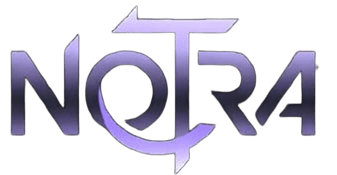

# NOCTRA - Banda K-AI



🎵 **NOCTRA** é um grupo K-AI (K-pop AI) com conceito etéreo, dark e espacial, misturando mistério, atmosferas densas e refrões marcantes.

## 📋 Sobre

NOCTRA não se limita a um único som ou imagem — cada comeback revela uma nova face. As integrantes carregam personalidades distintas, mas se conectam como constelações no mesmo céu.

**Cor oficial:** Roxo 💜  
**Fandom:** NOƆTRALS

### Membros

- **Han So-ra** - Main Vocal
- **Kang Ga-Yeon** - Lead Vocal
- **Park Seo-Min** - Main Rapper

## 🎶 Top Músicas

- 'TASTE IT BACK' (그것을 증명해 보세요)
- 'LOVE POTION' (사랑의 묘약)
- 'FALLEN ANGEL' (타락한 천)
- 'WILDFLOWER' (야생화)

## 💿 Albums

- **Mystic Hearts** - Album Completo

## 📁 Estrutura do Projeto

```
noctra 1.0/
├── index.html                 # Arquivo principal
├── README.md                  # Este arquivo
├── .gitignore                # Configuração do Git
├── css/
│   └── style.css             # Estilos principais
├── js/
│   └── script.js             # JavaScript interativo
└── assets/
    └── images/
        ├── members/          # Fotos dos membros
        ├── albums/           # Capas de albums
        ├── gallery/          # Imagens da galeria
        ├── music/            # Capas de músicas
        └── other/            # Outros recursos
```

## 🚀 Como Usar

1. Clone o repositório:
   ```bash
   git clone https://github.com/usuario/noctra.git
   ```

2. Abra o arquivo `index.html` em seu navegador.

## ✨ Funcionalidades

- 🎨 Design moderno com efeitos glassmorphic
- 📱 Layout responsivo para todos os dispositivos
- 🎭 Animações suaves e transições
- 🖼️ Galeria interativa com lightbox
- 🎵 Links para músicas no YouTube
- 📧 Newsletter integrada
- 🌙 Tema escuro elegante

## 🔗 Links Sociais

- [YouTube](https://www.youtube.com/@thenoctragirls_official)
- [TikTok](https://www.tiktok.com/@noctraofficial_)

## 📄 Licença

© 2026 AURE Entertainment. Todos os direitos reservados.

## 👤 Créditos

Desenvolvido com ❤ para fãs do K-pop.

---

**Siga NOCTRA nas redes sociais e vire parte dos NOƆTRALS! 💜**
